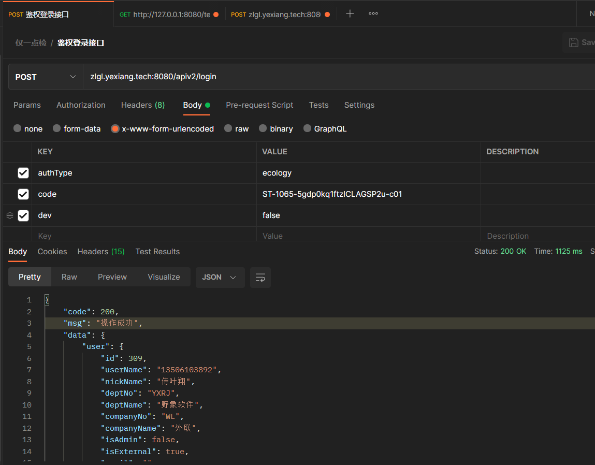

# PC端登录方式

* 采用泛微oauth2方式进行登录

## 登录步骤：
### 1. 跳转到泛微授权网址：

联调环境：
http://hi.joyea.cn:90/sso/oauth2.0/authorize?client_id=07837f2d-b06f-477b-89b8-e0f7df2e0ac9&response_type=code&redirect_uri=http://127.0.0.1:8080/%23/login#/login

生产环境：
http://hi.joyea.cn:90/sso/oauth2.0/authorize?client_id=356543ea-9f8d-4138-bd89-e798b9284e46&response_type=code&redirect_uri=http://zlgl.yexiang.tech:8080/%23/login#/login

### 2. 用户输入泛微用户名密码
### 3. 登录成功后会跳转到对应的地址：

联调环境：
http://127.0.0.1:8080/?ticket=ST-989-gCtevzjADtYxtzAX92OS-c01#/login

生产环境：
http://zlgl.yexiang.tech:8080/?ticket=ST-989-gCtevzjADtYxtzAX92OS-c01#/login

这时候需要将获取到的ticket上传至后台进行登录操作：
http://zlgl.yexiang.tech:8080/apiv2/login

**POST FORM 进行请求**

入参:
* authType:ecology   ##PC端是eclogy，手机端是nextplus
* code:ST-1001-Jd9T14aThhVWS9b1sK1B-c01  ##泛微返回的ticket，或者nextplus返回的code

*** 登录成功会返回用户信息，并且在response header中返回X-Token。后续的所有请求需要将X-Token放在请求头中。

